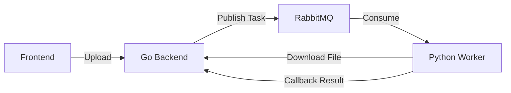

# AstraFlow Project Context

## Project Overview

AstraFlow is an intelligent reimbursement and bill management platform designed for Small and Medium Enterprises (SMEs). It leverages AI to automate the invoice recognition and reimbursement process.

**Core Components:**
*   **Frontend (`astraflow`):** Vue 3, Vite, Element Plus (Visual interface).
*   **Backend (`AstraFlow-go`):** Go, Gin, GORM, MySQL (Business logic, API).
*   **AI Worker (`ocr-ai-mac`):** Python, PaddleOCR, LLM (Invoice OCR and extraction via RabbitMQ).

## System Architecture

The system uses an asynchronous architecture for heavy AI processing:

1.  **User** uploads an invoice via the **Frontend**.
2.  **Backend** saves the file and publishes a task to **RabbitMQ** (`ocr_tasks` queue).
3.  **AI Worker** consumes the task, downloads the file from the Backend, performs OCR/LLM extraction.
4.  **AI Worker** sends the results back to the **Backend** via a webhook/callback (`POST /api/v1/callback/ocr-result`).



## Directory Structure

*   `astraflow/`: Frontend source code (Vue 3).
*   `AstraFlow-go/`: Backend source code (Go).
*   `ocr-ai-mac/`: **Active** AI Worker implementation (RabbitMQ Consumer).
*   `ocr-ai/`: **Deprecated/Alternative** Flask-based AI service.
*   `document/`: Project documentation.

## Building and Running

### Prerequisites
*   Node.js & npm
*   Go 1.22+
*   Python 3.10+
*   MySQL 8.0
*   RabbitMQ (Message Queue)

### 1. Frontend (`astraflow`)
```bash
cd astraflow
npm install
npm run dev
```

### 2. Backend (`AstraFlow-go`)
Ensure MySQL and RabbitMQ are running.
```bash
cd AstraFlow-go
# Run migrations (Initialize DB)
go run cmd/migrate/main.go
# Start Server (Default port 8081)
go run cmd/server/main.go
```

### 3. AI Worker (`ocr-ai-mac`)
Ensure RabbitMQ is running.
```bash
cd ocr-ai-mac
# Install dependencies
pip install -r requirements.txt
# Start the worker
python worker.py
```

## Configuration & Environment

### AI Worker (`ocr-ai-mac`)
Uses `ocr-ai-mac/.env` (create if missing) or environment variables:
*   `RABBITMQ_HOST`: default `localhost`
*   `RABBITMQ_PORT`: default `5672`
*   `RABBITMQ_USER`: default `admin` (Check `worker.py` or local setup)
*   `RABBITMQ_PASSWORD`: default `password`

### Backend (`AstraFlow-go`)
Configuration in `pkg/config/config.yml` or `.env`. Needs to point to the same RabbitMQ instance.

## Development Conventions

### Backend (Go)
*   **Clean Architecture:** `router` -> `handler` -> `service` -> `repository`.
*   **Database:** GORM with AutoMigrate.
*   **Async Patterns:** Uses `amqp` for queuing tasks.

### AI Worker (Python)
*   **Entry Point:** `worker.py`.
*   **Logic:**
    1.  Listens on `ocr_tasks` queue.
    2.  Downloads file from Backend URL (e.g., `http://localhost:8081/uploads/...`).
    3.  Runs `ocr_module.py` (PaddleOCR) + `ai_module.py` (LLM).
    4.  POSTs result to Backend callback.
